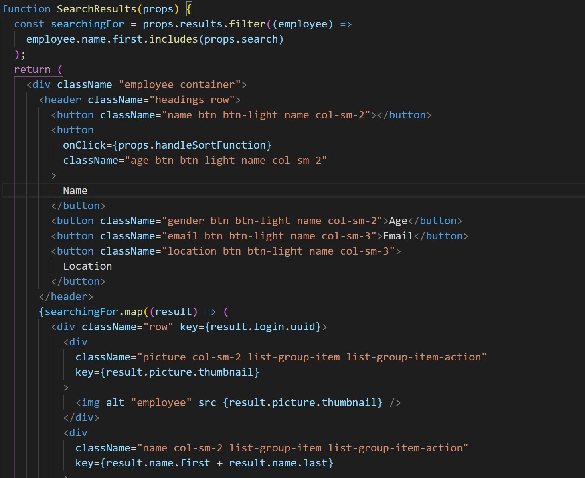
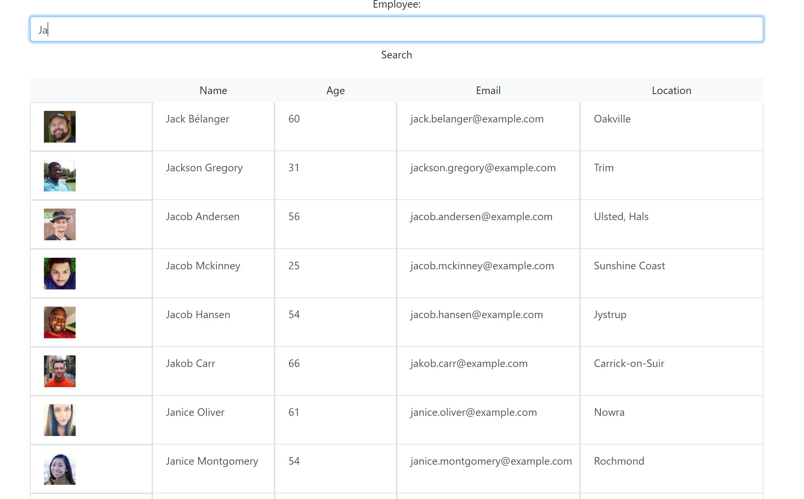

# Employee Directory

## Description

This project uses react and random.api to generate an employee list. It allows users to search for an employee and order by name

## Table Of Contents

- [Installation](##Installation)
- [Usage](##Usage)
- [License](##License)
- [Contributing](##Contributing)
- [Tests](##Tests)
- [Questions](##Questions)

## Installation

The API generates 1000 random users, this is used as an exmaple. You can then type in the name of an employer you want to find and you can order by alphabetical order

## Usage

## License

This project is covered under the MIT License

## Contributing

The above image is an example of the react code used in this project. The below image is how the application looks

## Tests

got to https://bencyna.github.io/EmployeeDirectory

## Questions

If you have any questions about this project, you can veiw my github account at https://github.com/bencyna or find me on linked in at https://www.linkedin.com/in/bencyna567/
